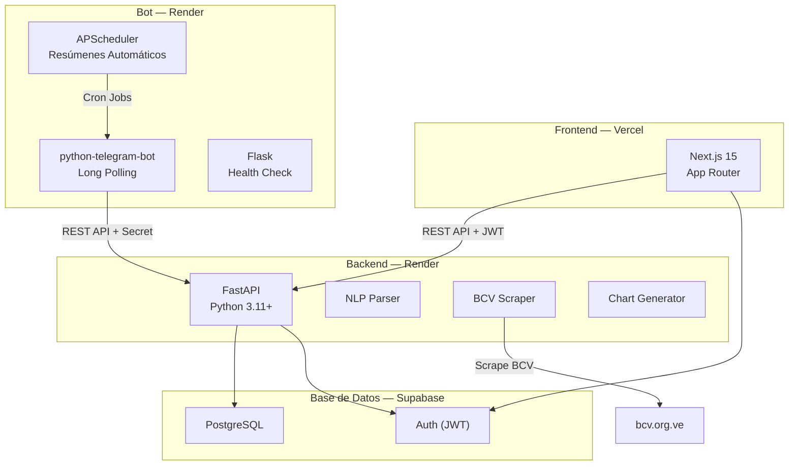
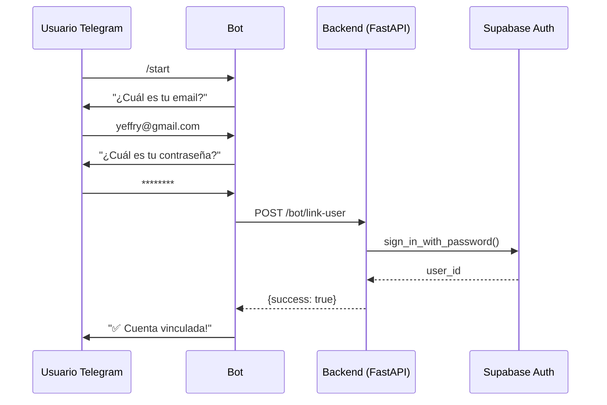
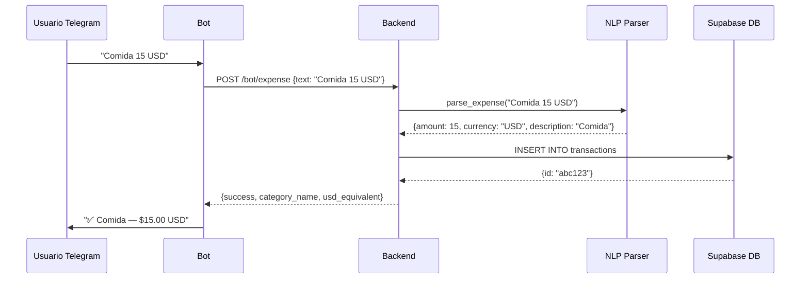
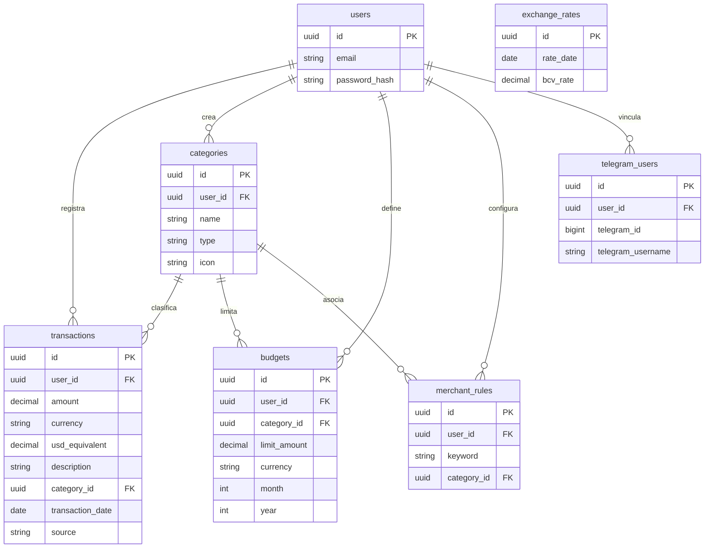

# 📊 Churupo Tracker — Documentación del Sistema

> **Sistema de Gestión de Finanzas Personales Bi-Monetario (VES/USD)**
> Versión 2.0.0 | Mayo 2026

---

## 📋 Tabla de Contenidos

1. [¿Qué es Churupo Tracker?](#qué-es-churupo-tracker)
2. [Arquitectura del Sistema](#arquitectura-del-sistema)
3. [Funcionalidades](#funcionalidades)
4. [Stack Tecnológico](#stack-tecnológico)
5. [Estructura del Proyecto](#estructura-del-proyecto)
6. [API — Referencia de Endpoints](#api--referencia-de-endpoints)
7. [Bot de Telegram](#bot-de-telegram)
8. [Base de Datos](#base-de-datos)
9. [Despliegue en Producción](#despliegue-en-producción)
10. [Variables de Entorno](#variables-de-entorno)

---

## ¿Qué es Churupo Tracker?

Churupo Tracker es un **sistema completo de gestión de finanzas personales** diseñado específicamente para usuarios en Venezuela que manejan dos monedas simultáneamente: **Bolívares (VES)** y **Dólares (USD)**.

El sistema permite registrar gastos desde un elegante panel web o directamente desde **Telegram** con lenguaje natural (ejemplo: *"Comida 15 USD"*), y convierte automáticamente entre monedas usando la tasa **BCV** del día.

### Problema que resuelve

En Venezuela, la dualidad monetaria hace difícil tener una vista clara de cuánto se gasta realmente. Churupo Tracker:
- Unifica todos los gastos en un equivalente USD para comparación real.
- Permite registrar gastos al instante desde Telegram sin abrir ninguna app.
- Envía resúmenes automáticos diarios, semanales y mensuales.
- Alerta cuando un presupuesto está por agotarse.

---

## Arquitectura del Sistema



### Flujo de Datos

1. **Usuario Web** → Se autentica con Supabase Auth → Recibe JWT → Llama al Backend con el JWT → Backend consulta PostgreSQL.
2. **Usuario Telegram** → Envía texto al bot → Bot llama al Backend con `x-bot-secret` → Backend parsea el texto con NLP → Guarda en PostgreSQL.
3. **Scheduler** → A las 10pm cada día, el bot consulta el backend y envía resúmenes a todos los usuarios vinculados.

### Keep-Alive

Un workflow de **GitHub Actions** (`.github/workflows/keep-awake.yml`) pinguea cada 10 minutos los endpoints `/health` del backend y del bot para prevenir que Render duerma los servicios gratuitos por inactividad. Si el bot se cae por cualquier motivo, se reconecta automáticamente en 10 segundos.

---

## Funcionalidades

### 🖥️ Panel Web (Frontend)

| Módulo | Descripción |
|---|---|
| **Dashboard** | Resumen mensual con total gastado, ingresos, balance, desglose por categoría con indicadores de semáforo (🟢🟡🔴) y **gráfico de dona interactivo** (Recharts). |
| **Transacciones** | CRUD completo con filtros por fecha, categoría, moneda y fuente. Búsqueda por texto. Modal con scroll. |
| **Categorías** | Crear/editar/eliminar categorías personalizadas con tipo (gasto o ingreso) e icono. Modal con 48+ iconos en grilla de 8 columnas. |
| **Presupuestos** | Asignar límites mensuales por categoría. Visualización de porcentaje consumido. Filtro por mes/año. Modal con scroll. |
| **Gastos Fijos** | Vista de gastos recurrentes con conversión VES→USD usando tasa BCV en vivo. Tarjetas separadas USD/VES/total. |
| **Modo Claro/Oscuro** | Toggle de tema visual. |
| **Autenticación** | Registro e inicio de sesión con email/contraseña vía Supabase Auth. Redirección post-login sin errores de token. |

### 🤖 Bot de Telegram

| Comando | Descripción |
|---|---|
| `/start` | Vincula la cuenta de Telegram con Supabase (email + contraseña). |
| `/ayuda` o `/help` | Muestra todos los comandos disponibles. |
| `/tasa` | Consulta la tasa BCV del día en tiempo real. |
| `/presupuestos` | Estado actual de todos los presupuestos con semáforo. |
| `/ultimos` | Últimas 5 transacciones registradas. |
| `/grafico` | Genera y envía un gráfico PNG del desglose mensual. |
| *(texto libre)* | Parsea automáticamente: `"Comida 15 USD"` → registra el gasto. |

### ⏰ Resúmenes Automáticos (Scheduler)

| Frecuencia | Hora (Venezuela) | Contenido |
|---|---|---|
| **Diario** | 10:00 PM | Gastos del día + total en USD. |
| **Semanal** | Domingo 8:00 PM | Top 3 categorías + alertas de presupuesto. |
| **Mensual** | Último día del mes, 9:00 PM | Total del mes + presupuestos excedidos. |

### 🧠 Motor NLP (Procesamiento de Lenguaje Natural)

El parser entiende múltiples formatos de entrada:

```
"Comida 15 USD"          → $15.00 USD — Comida
"Gasolina 50000 VES"     → Bs. 50,000 VES — Gasolina
"Uber 8.5$"              → $8.50 USD — Uber
"Mercado 120,50 bs"      → Bs. 120.50 VES — Mercado
"Netflix 12 dolares"     → $12.00 USD — Netflix
"15 USD comida"          → $15.00 USD — Comida
```

Detecta automáticamente: `$`, `USD`, `dólares`, `VES`, `Bs`, `bolívares` y variaciones.

---

## Stack Tecnológico

| Capa | Tecnología | Versión |
|---|---|---|
| **Frontend** | Next.js (App Router) | 15.x |
| **Estilos** | CSS custom (globals.css) | — |
| **Gráficos** | Recharts | — |
| **Backend** | FastAPI | 0.115.x |
| **Lenguaje Backend** | Python | 3.11+ |
| **Base de Datos** | PostgreSQL (Supabase) | 15.x |
| **Autenticación** | Supabase Auth (JWT) | — |
| **Bot** | python-telegram-bot (long polling) | 21.x |
| **Scheduler** | APScheduler | 3.10.x |
| **Scraping** | httpx + BeautifulSoup | — |
| **Gráficos PNG** | matplotlib | — |
| **Health Check** | Flask | 3.x |
| **Hosting Frontend** | Vercel | — |
| **Hosting Backend** | Render | — |
| **Hosting Bot** | Render | — |
| **Keep-Alive** | GitHub Actions (cron */10) | — |

---

## Estructura del Proyecto

```
churupo-tracker/
├── backend/                    # API FastAPI
│   ├── main.py                 # Entry point + CORS + /exchange-rate
│   ├── config.py               # Pydantic Settings
│   ├── dependencies.py         # Auth middleware (JWT)
│   ├── supabase_client.py      # Conexión a Supabase
│   ├── routers/
│   │   ├── analytics.py        # GET /analytics/summary
│   │   ├── bot_internal.py     # POST /bot/* (autenticado con secret)
│   │   ├── budgets.py          # CRUD /budgets/ (con filtro mes/año)
│   │   ├── categories.py       # CRUD /categories/
│   │   ├── merchant_rules.py   # CRUD /merchant-rules/
│   │   └── transactions.py     # CRUD /transactions/
│   ├── services/
│   │   ├── bcv_scraper.py      # Scraping tasa BCV
│   │   ├── chart_generator.py  # Genera gráficos PNG
│   │   ├── database.py         # Helpers de DB
│   │   └── nlp_parser.py       # Parser de lenguaje natural
│   ├── schemas/                # Pydantic models
│   └── requirements.txt
│
├── frontend/                   # Next.js 15
│   ├── src/
│   │   ├── app/
│   │   │   ├── dashboard/      # Panel principal (donut chart)
│   │   │   ├── transacciones/  # Lista de transacciones
│   │   │   ├── categorias/     # Gestión de categorías
│   │   │   ├── presupuestos/   # Gestión de presupuestos
│   │   │   ├── gastos-fijos/   # Gastos recurrentes + BCV rate
│   │   │   ├── login/          # Inicio de sesión
│   │   │   └── register/       # Registro
│   │   ├── components/         # Componentes reutilizables
│   │   │   ├── Sidebar.tsx
│   │   │   ├── ThemeToggle.tsx
│   │   │   ├── CategoryDonutChart.tsx
│   │   │   └── ...
│   │   └── lib/
│   │       ├── api.ts          # Cliente HTTP con auth + 401 handler
│   │       └── supabase.ts     # Cliente Supabase
│   ├── middleware.ts            # Protección de rutas
│   ├── vercel.json             # Configuración de despliegue
│   ├── next.config.ts
│   └── package.json
│
├── telegram_bot/               # Bot de Telegram
│   ├── bot.py                  # Entry point (polling + Flask health)
│   ├── config.py               # Variables de entorno
│   ├── api_client.py           # Cliente HTTP al backend
│   ├── scheduler.py            # Resúmenes automáticos
│   ├── handlers/
│   │   ├── start.py            # /start (vinculación)
│   │   ├── expense.py          # Texto libre → gasto
│   │   ├── tasa.py             # /tasa
│   │   ├── budgets.py          # /presupuestos
│   │   ├── transactions.py     # /ultimos
│   │   ├── chart.py            # /grafico
│   │   └── help.py             # /ayuda
│   └── requirements.txt
│
├── supabase/                   # Migraciones y config
├── .github/workflows/
│   └── keep-awake.yml          # Ping a backend y bot cada 10 min
├── iniciar_proyecto.bat        # Script para dev local
└── iniciar_bot.bat             # Script para bot local
```

---

## API — Referencia de Endpoints

> Todos los endpoints (excepto `/health` y `/bot/*`) requieren header `Authorization: Bearer <JWT>`.

### Health Check
| Método | Ruta | Descripción |
|---|---|---|
| `GET` | `/health` | Estado del servidor. Retorna `{"status": "ok"}` |

### Tasa de Cambio
| Método | Ruta | Descripción |
|---|---|---|
| `GET` | `/exchange-rate` | Tasa BCV actual (requiere JWT). |

### Transacciones (`/transactions/`)
| Método | Ruta | Descripción |
|---|---|---|
| `GET` | `/transactions/` | Lista transacciones con filtros opcionales. |
| `POST` | `/transactions/` | Crear nueva transacción. |
| `GET` | `/transactions/{id}` | Detalle de una transacción. |
| `PUT` | `/transactions/{id}` | Editar transacción. |
| `DELETE` | `/transactions/{id}` | Eliminar transacción. |

### Categorías (`/categories/`)
| Método | Ruta | Descripción |
|---|---|---|
| `GET` | `/categories/` | Listar categorías del usuario. |
| `POST` | `/categories/` | Crear categoría. |
| `PUT` | `/categories/{id}` | Editar categoría. |
| `DELETE` | `/categories/{id}` | Eliminar categoría. |

### Presupuestos (`/budgets/`)
| Método | Ruta | Descripción |
|---|---|---|
| `GET` | `/budgets/?month=5&year=2026` | Presupuestos del mes. |
| `POST` | `/budgets/` | Crear presupuesto. |
| `DELETE` | `/budgets/{id}` | Eliminar presupuesto. |

### Analytics (`/analytics/`)
| Método | Ruta | Descripción |
|---|---|---|
| `GET` | `/analytics/summary?month=5&year=2026` | Resumen mensual completo. |

### Merchant Rules (`/merchant-rules/`)
| Método | Ruta | Descripción |
|---|---|---|
| `GET` | `/merchant-rules/` | Listar reglas. |
| `POST` | `/merchant-rules/` | Crear regla (keyword → categoría). |
| `DELETE` | `/merchant-rules/{id}` | Eliminar regla. |

### Bot Internal (`/bot/`) — Auth: `x-bot-secret`
| Método | Ruta | Descripción |
|---|---|---|
| `POST` | `/bot/link-user` | Vincular Telegram con Supabase. |
| `POST` | `/bot/expense` | Registrar gasto por texto natural. |
| `GET` | `/bot/budgets/{telegram_id}` | Estado de presupuestos. |
| `GET` | `/bot/transactions/{telegram_id}` | Últimas transacciones. |
| `GET` | `/bot/chart/{telegram_id}` | Gráfico PNG mensual. |
| `GET` | `/bot/tasa` | Tasa BCV actual. |
| `GET` | `/bot/all-users` | Todos los usuarios vinculados. |

---

## Bot de Telegram

El bot funciona con **long polling** en vez de webhooks para evitar conflictos de puertos en Render. Un servidor Flask integrado corre en el mismo `$PORT` exclusivamente para health checks y mantener el servicio despierto.

Si el polling falla (timeout, desconexión), el bot se reconecta automáticamente tras 10 segundos.

### Flujo de Vinculación



### Flujo de Registro de Gasto



---

## Base de Datos

### Tablas Principales



---

## Despliegue en Producción

### Frontend — Vercel

| Configuración | Valor |
|---|---|
| **Repositorio** | `github.com/ingyeffersonhh-dev/churupo-tracker` |
| **Root Directory** | `frontend` |
| **Framework** | Next.js (auto-detectado via `vercel.json`) |
| **Build Command** | `next build` |
| **URL** | `https://churupo-tracker.vercel.app` |

### Backend — Render

| Configuración | Valor |
|---|---|
| **Tipo** | Web Service |
| **Root Directory** | `backend` |
| **Build Command** | `pip install -r requirements.txt` |
| **Start Command** | `uvicorn main:app --host 0.0.0.0 --port $PORT` |
| **URL** | `https://churupo-backend.onrender.com` |

### Bot de Telegram — Render

| Configuración | Valor |
|---|---|
| **Tipo** | Web Service |
| **Root Directory** | *(vacío — usar la raíz del repo)* |
| **Build Command** | `pip install -r telegram_bot/requirements.txt` |
| **Start Command** | `python telegram_bot/bot.py` |
| **URL** | `https://churupo-bot-wtql.onrender.com` |

> **Nota**: El bot usa long polling con Flask integrado para health checks en `$PORT`. No requiere `PUBLIC_URL` ni configuración de webhook.

---

## Variables de Entorno

### Frontend (Vercel)

| Variable | Descripción | Ejemplo |
|---|---|---|
| `NEXT_PUBLIC_SUPABASE_URL` | URL del proyecto Supabase | `https://xxx.supabase.co` |
| `NEXT_PUBLIC_SUPABASE_ANON_KEY` | Clave pública de Supabase | `eyJhbGci...` |
| `NEXT_PUBLIC_API_URL` | URL del backend en Render | `https://churupo-backend.onrender.com` |

### Backend (Render)

| Variable | Descripción | Ejemplo |
|---|---|---|
| `SUPABASE_URL` | URL del proyecto Supabase | `https://xxx.supabase.co` |
| `SUPABASE_SERVICE_KEY` | Clave de servicio (full access) | `eyJhbGci...` |
| `SUPABASE_ANON_KEY` | Clave pública | `eyJhbGci...` |
| `TELEGRAM_BOT_TOKEN` | Token de BotFather | `8640103975:AAE...` |
| `BOT_INTERNAL_SECRET` | Secreto compartido bot↔backend | `changeme-super-secret-key` |
| `ALLOWED_ORIGINS` | URL del frontend (CORS) | `https://churupo-tracker.vercel.app` |

### Bot (Render)

| Variable | Descripción | Ejemplo |
|---|---|---|
| `TELEGRAM_BOT_TOKEN` | Token de BotFather | `8640103975:AAE...` |
| `BACKEND_URL` | URL del backend | `https://churupo-backend.onrender.com` |
| `BOT_INTERNAL_SECRET` | Debe coincidir con el del backend | `changeme-super-secret-key` |

> El bot **no** necesita `PUBLIC_URL` — funciona vía long polling.

---

> **Nota**: Esta documentación fue generada el 12 de mayo de 2026. Para la versión más actualizada del código, consultar el repositorio en GitHub: `github.com/ingyeffersonhh-dev/churupo-tracker`.
